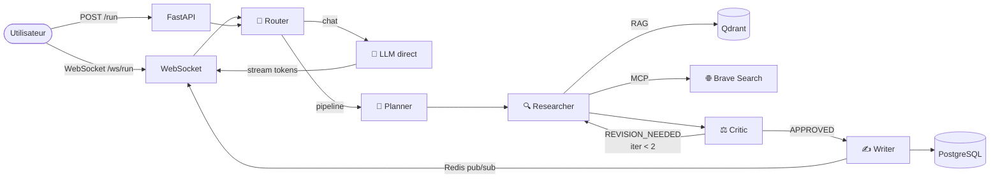

# 🤖 Multi-Agent System

<p align="center">
  
  
  
  
  
  
  
  
</p>

<p align="center">
  Système multi-agents orchestré par <strong>LangGraph</strong>, avec routage automatique<br/>
  <strong>chat direct</strong> ou <strong>pipeline complet</strong>, ingestion RAG multi-sources,<br/>
  outils <strong>MCP</strong> extensibles (Brave Search), streaming WebSocket via <strong>Redis pub/sub</strong><br/>
  et interface <strong>Next.js</strong>.
</p>

---

## Architecture



| Service | Rôle | Port |
|---|---|---|
| Next.js 14 | Interface web (App Router + Tailwind) | `3000` |
| FastAPI | REST + WebSocket | `8000` |
| PostgreSQL 16 | Persistance conversations & runs | `5432` |
| Redis 7 | Pub/sub streaming WebSocket | `6379` |
| Qdrant | Mémoire vectorielle RAG | `6333` |
| Adminer | Interface web PostgreSQL | `8080` |
| RedisInsight | Interface web Redis | `5540` |
| OpenRouter | Broker LLM (Claude Haiku 4.5) | external |

---

## Démarrage rapide

```bash
# 1. Variables d'environnement
cp .env.example .env
# → Renseigner OPENROUTER_API_KEY

# 2. Lancer tous les services
docker compose up -d

# Interface    → http://localhost:3000
# API          → http://localhost:8000
# Swagger      → http://localhost:8000/docs
# Health       → http://localhost:8000/health
# Adminer      → http://localhost:8080   (PostgreSQL GUI)
# RedisInsight → http://localhost:5540   (Redis GUI)
```

---

## Routage automatique

Le système détecte automatiquement si la question nécessite le pipeline complet ou une réponse directe :

| Mode | Exemples | Flux |
|---|---|---|
| **Chat direct** | "Bonjour", "C'est quoi Python ?", "Fais une blague" | Router → LLM → réponse streamée |
| **Pipeline** | "Analyse le RAG vs fine-tuning", "Rédige un rapport sur…" | Router → Planner → Researcher (RAG + MCP) → Critic → Writer |

Le pipeline se grisce automatiquement en mode chat — aucune action de l'utilisateur requise.

---

## Interface web

Accessible sur **http://localhost:3000** — Next.js 14, App Router, Tailwind CSS, TypeScript.

| Zone | Fonctionnalité |
|---|---|
| **Pipeline** | 4 étapes animées — grisées en chat direct, animées en pipeline |
| **Chat** | Streaming token par token avec curseur clignotant |
| **Sidebar — Session** | Changer de session, charger l'historique |
| **Sidebar — Ingestion** | 3 onglets : Texte / Fichier (drag-and-drop PDF DOCX TXT) / URL |
| **Sidebar — Historique** | Tous les runs de la session, cliquables |

---

## MCP — Outils externes

Le Researcher exécute **RAG Qdrant + tous les outils MCP en parallèle** et injecte les résultats dans le prompt.

### Activer Brave Search

1. Obtenir une clé gratuite sur [brave.com/search/api](https://brave.com/search/api/)
2. Ajouter dans `.env` :

```env
BRAVE_API_KEY=bsv-votre-clé
```

Les résultats web apparaissent automatiquement dans le contexte du Researcher. Si la clé est absente, le système fonctionne normalement sans recherche web.

### Ajouter un nouvel outil MCP

```python
# app/services/mcp_client.py

class GitHubSearchTool(MCPTool):
    @property
    def name(self) -> str: return "github_search"

    @property
    def description(self) -> str: return "Recherche dans les dépôts GitHub"

    def is_available(self) -> bool: return bool(settings.github_token)

    async def run(self, query: str) -> str:
        # ... appel API GitHub
        return résultat

# Dans setup_mcp() :
registry.register(GitHubSearchTool())
```

**Garanties :** un outil qui plante → log warning, pipeline continue. Clé absente → outil ignoré.

---

## Ingestion RAG

```bash
# Texte brut
curl -X POST http://localhost:8000/api/v1/documents \
  -H "Content-Type: application/json" \
  -d '{"text": "Le RAG combine recherche vectorielle et génération LLM.", "id": "doc-1"}'

# Fichier PDF / DOCX / TXT
curl -X POST http://localhost:8000/api/v1/documents/upload \
  -F "file=@rapport.pdf"

# Page web
curl -X POST http://localhost:8000/api/v1/documents/url \
  -H "Content-Type: application/json" \
  -d '{"url": "https://example.com/article"}'

# Lot de documents
curl -X POST http://localhost:8000/api/v1/documents/batch \
  -H "Content-Type: application/json" \
  -d '{"documents": [{"text": "...", "id": "doc-2"}, {"text": "...", "id": "doc-3"}]}'
```

---

## Endpoints

### Lancer un workflow (mode batch)

```bash
curl -X POST http://localhost:8000/api/v1/run \
  -H "Content-Type: application/json" \
  -d '{"task": "Explique les avantages du RAG vs fine-tuning", "session_id": "session-1"}'
```

### Historique d'une session

```bash
curl http://localhost:8000/api/v1/sessions/session-1/runs
```

### Streaming temps réel (WebSocket)

```javascript
const ws = new WebSocket("ws://localhost:8000/ws/run");

ws.onopen = () => ws.send(JSON.stringify({
  task: "Analyse les tendances IA en 2025",
  session_id: "session-1"
}));

ws.onmessage = ({ data }) => {
  const { type, mode, agent, content, final_answer } = JSON.parse(data);
  // type: "mode" | "agent_start" | "token" | "agent_done" | "done" | "error"
  // mode (dans l'event "mode") : "chat" | "pipeline"
  // "done" inclut final_answer et iterations
};
```

---

## Tests

```bash
pip install -r requirements-dev.txt
pytest -v
```

```
tests/test_agents/test_critic.py            ....
tests/test_agents/test_orchestrator.py      ........
tests/test_agents/test_planner.py           ....
tests/test_agents/test_researcher.py        ......
tests/test_agents/test_router.py            .....
tests/test_agents/test_writer.py            ....
tests/test_api/test_documents.py            ...........
tests/test_api/test_routes.py               .......
tests/test_api/test_websocket.py            ................
tests/test_services/test_mcp_client.py      .............

78 passed in 15.55s
```

---

## Structure

```
frontend-next/                # Interface Next.js 14
└── src/
    ├── app/
    │   ├── layout.tsx        # Layout racine
    │   ├── page.tsx          # Page principale (state, WebSocket, routing)
    │   └── globals.css
    └── components/
        ├── Pipeline.tsx      # 4 étapes animées
        ├── ChatArea.tsx      # Messages + streaming
        ├── Sidebar.tsx       # Session, ingestion, historique
        └── DocumentUpload.tsx# Onglets Texte / Fichier / URL
app/
├── agents/
│   ├── router.py         # Classifie : "chat" ou "pipeline"
│   ├── state.py          # AgentState TypedDict partagé
│   ├── orchestrator.py   # stream_and_publish, _stream_direct_chat, _stream_pipeline
│   ├── planner.py        # Décompose la tâche
│   ├── researcher.py     # RAG + LLM
│   ├── critic.py         # Évalue, déclenche révisions
│   └── writer.py         # Rédige la réponse finale
├── api/
│   ├── routes.py         # POST /run · GET /sessions/{id}/runs
│   ├── documents.py      # POST /documents · /batch · /upload · /url
│   └── websocket.py      # Streaming via Redis pub/sub + persistance
├── services/
│   ├── llm.py            # chat_completion + stream_completion + embed
│   ├── document_parser.py# PDF (pdfplumber) · DOCX · TXT · URL (bs4)
│   ├── vector_store.py   # Client Qdrant (query_points)
│   ├── cache.py          # Client Redis pub/sub
│   └── mcp_client.py     # MCPTool ABC · MCPRegistry · BraveSearchTool
├── db/
│   ├── models.py         # Conversation · Run (SQLAlchemy 2.0)
│   └── session.py        # Engine async + get_session
└── core/
    ├── config.py         # pydantic-settings
    └── logging.py        # structlog — logs structurés
alembic/                  # Migrations versionnées
```

---

## Points forts

| | Détail |
|---|---|
| **Routage automatique** | Router LLM distingue chat direct et pipeline — zéro friction utilisateur |
| **Feedback loop** | Le Critic renvoie au Researcher jusqu'à 2× si la recherche est insuffisante |
| **Streaming découplé** | Redis pub/sub — N clients peuvent s'abonner au même run simultanément |
| **Persistance universelle** | Runs persistés en base que ce soit via REST ou WebSocket |
| **RAG multi-sources** | Qdrant + ingestion texte, PDF, DOCX, TXT, URL avec extraction automatique |
| **Routing LLM** | Modèle cheap (Planner/Critic/Router) vs smart (Writer/Chat) — optimisation des coûts |
| **MCP extensible** | Brave Search activé par clé API — ajouter un outil = 1 classe + 1 ligne, jamais de rupture |
| **Checkpointing** | LangGraph mémorise l'état par `session_id` entre les requêtes |
| **Observabilité** | structlog dans chaque agent — modèle, durée, itérations, outils MCP utilisés |
| **Migrations** | Alembic versionné — `make migrate` |
| **Interface Next.js** | App Router, Tailwind, TypeScript — pipeline animé, ingestion RAG, historique |
| **CI** | GitHub Actions — 78 tests sur Python 3.11 & 3.12 à chaque push |
| **Production-ready** | Docker Compose, health checks, Makefile, async partout |
