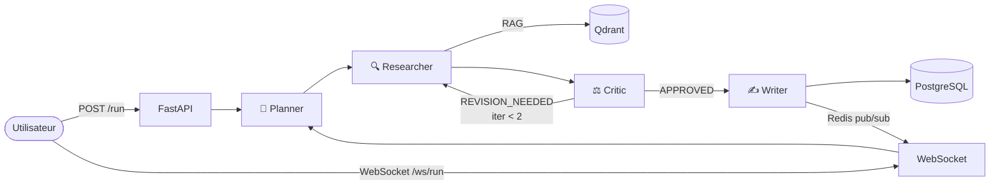

# 🤖 Multi-Agent System

<p align="center">
  
  
  
  
  
  
</p>

<p align="center">
  Pipeline multi-agents orchestré par <strong>LangGraph</strong>, exposé via <strong>FastAPI</strong>,<br/>
  avec streaming WebSocket temps réel via <strong>Redis pub/sub</strong>.
</p>

---

## Architecture



| Service | Rôle | Port |
|---|---|---|
| FastAPI | REST + WebSocket | `8000` |
| PostgreSQL 16 | Persistance conversations & runs | `5432` |
| Redis 7 | Pub/sub streaming WebSocket | `6379` |
| Qdrant | Mémoire vectorielle RAG | `6333` |
| OpenRouter | Broker LLM (Claude Haiku 4.5) | external |

---

## Démarrage rapide

```bash
# 1. Variables d'environnement
cp .env.example .env
# → Renseigner OPENROUTER_API_KEY

# 2. Lancer tous les services
docker compose up -d

# API      → http://localhost:8000
# Swagger  → http://localhost:8000/docs
```

---

## Endpoints

### Ingérer des documents dans le RAG

```bash
# Document unique (id auto-généré si omis)
curl -X POST http://localhost:8000/api/v1/documents \
  -H "Content-Type: application/json" \
  -d '{"text": "Le RAG combine recherche vectorielle et génération LLM.", "id": "doc-1"}'

# Lot de documents
curl -X POST http://localhost:8000/api/v1/documents/batch \
  -H "Content-Type: application/json" \
  -d '{"documents": [{"text": "...", "id": "doc-2"}, {"text": "...", "id": "doc-3"}]}'
```

### Lancer un workflow (mode batch)

```bash
curl -X POST http://localhost:8000/api/v1/run \
  -H "Content-Type: application/json" \
  -d '{"task": "Explique les avantages du RAG vs fine-tuning", "session_id": "session-1"}'
```

### Historique d'une session

```bash
curl http://localhost:8000/api/v1/sessions/session-1/runs
```

### Streaming temps réel (WebSocket)

```javascript
const ws = new WebSocket("ws://localhost:8000/ws/run");

ws.onopen = () => ws.send(JSON.stringify({
  task: "Analyse les tendances IA en 2025",
  session_id: "session-2"
}));

ws.onmessage = ({ data }) => {
  const { type, agent, content } = JSON.parse(data);
  // type: "agent_start" | "token" | "agent_done" | "done" | "error"
};
```

---

## Tests

```bash
pip install -r requirements-dev.txt
pytest -v
```

```
tests/test_agents/test_critic.py        ....
tests/test_agents/test_orchestrator.py  ........
tests/test_agents/test_planner.py       ....
tests/test_agents/test_researcher.py    ....
tests/test_agents/test_writer.py        ....
tests/test_api/test_documents.py        ......
tests/test_api/test_routes.py           .......
tests/test_api/test_websocket.py        .........

46 passed in 0.16s
```

---

## Structure

```
app/
├── agents/
│   ├── state.py          # AgentState TypedDict partagé
│   ├── orchestrator.py   # Graph LangGraph + stream_and_publish
│   ├── planner.py        # Décompose la tâche
│   ├── researcher.py     # RAG + LLM
│   ├── critic.py         # Évalue, déclenche révisions
│   └── writer.py         # Rédige la réponse finale
├── api/
│   ├── routes.py         # POST /run · GET /sessions/{id}/runs
│   ├── documents.py      # POST /documents · POST /documents/batch
│   └── websocket.py      # Streaming via Redis pub/sub
├── services/
│   ├── llm.py            # Wrapper OpenRouter (chat + embed)
│   ├── vector_store.py   # Client Qdrant
│   └── cache.py          # Client Redis pub/sub
├── db/
│   ├── models.py         # Conversation · Run (SQLAlchemy 2.0)
│   └── session.py        # Engine async + get_session
└── core/config.py        # pydantic-settings
```

---

## Points forts

| | Détail |
|---|---|
| **Feedback loop** | Le Critic renvoie au Researcher jusqu'à 2× si la recherche est insuffisante |
| **Streaming découplé** | Redis pub/sub — N clients peuvent s'abonner au même run simultanément |
| **RAG opérationnel** | Qdrant + embeddings OpenRouter + endpoint d'ingestion unitaire & batch |
| **Routing LLM** | Modèle cheap (Planner/Critic) vs smart (Writer) — optimisation des coûts |
| **Checkpointing** | LangGraph mémorise l'état par `session_id` entre les requêtes |
| **Production-ready** | Docker Compose, health checks, async partout, 46 tests |
